<p align="center">
  <a href="https://dotnet9.com">
    
  </a>
</p>

<h1 align="center">Dotnet9</h1>

<div align="center">

一个使用`Dotnet 8.0`开发的`博客`系统，开发中...

     <a target="_blank" href="https://qm.qq.com/cgi-bin/qm/qr?k=iL6egdGSGCMPezcUyzMPEcs9qsllgwr-&jump_from=webapi"></a> [](https://gitee.com/dotnet9/Dotnet9)   [](https://github.com/dotnet9/Dotnet9) [](https://github.com/dotnet9/Dotnet9)

 


## Stargazers over time

[](https://starchart.cc/dotnet9/Dotnet9)

 </div>


 ## 0. 最新开发情况

- [x] 前台前端
  1. [x] 使用Vue3 + Typescript + Vuetify + Pinia搭建前台
  2. [x] 已有功能：文章列表、分类文章列表、专辑文章列表、标签云、文章详情、文章评论、归档、留言、关于等
  3. [ ] 还有很多功能待开发，比如隐私、评论管理等
- [x] 后台前端
  1. [x] 使用Vue3 + Typescript + Vuetify + Pinia搭建
  2. [x] 基础表的CRUD
  5. [ ] 其他功能
- [x] 后端
  1. [x] 使用.NET 8 + Furion + SqlSugar + PostgreSQL搭建
  3. [x] 提供前后台前端接口-基础表的接口管理
  4. [ ] 根据前台和后台前端的功能迭代，进行维护中

## ✨ 1. 特性

1. 后端使用使用`.NET 8.0`开发，前端使用Vue 3.2
2. 带博客浏览功能
3. 带工具使用

## 🌈 2. 在线示例

- Dotnet9：[https://dotnet9.com](https://dotnet9.com)

### 2.1. 前台前端

首页封面

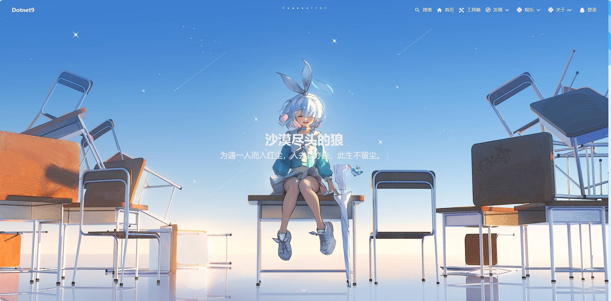

首页文章列表

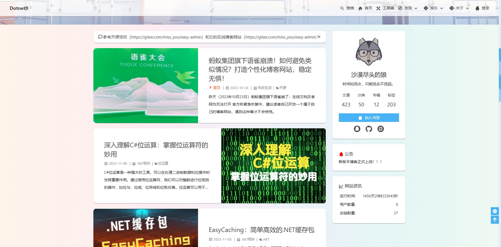

文章分类

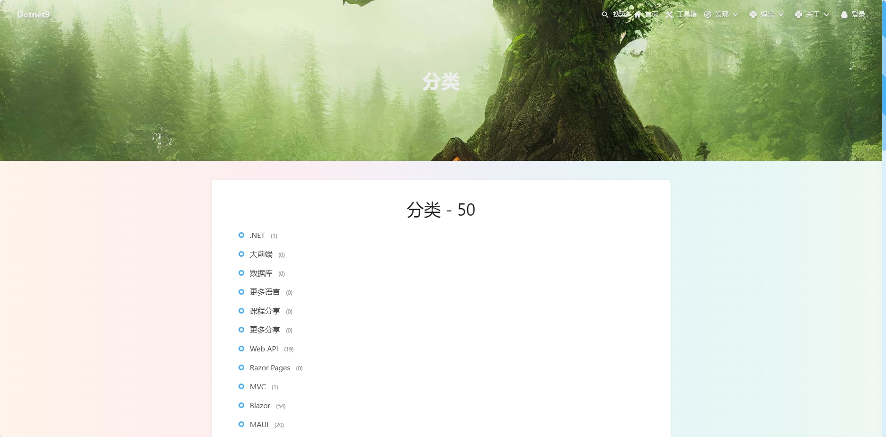

分类文章列表

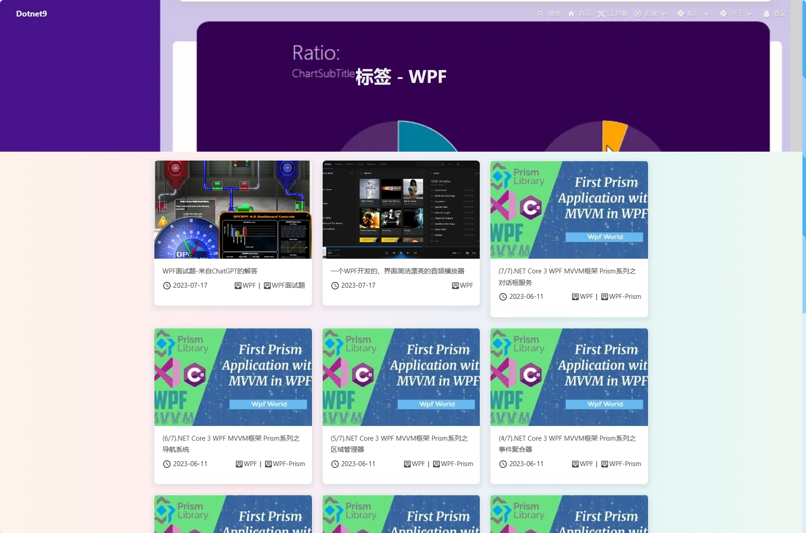

文章专辑

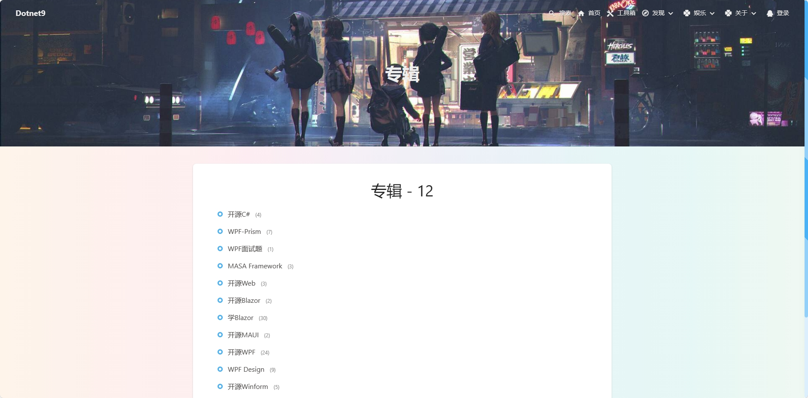

专辑文章列表.png

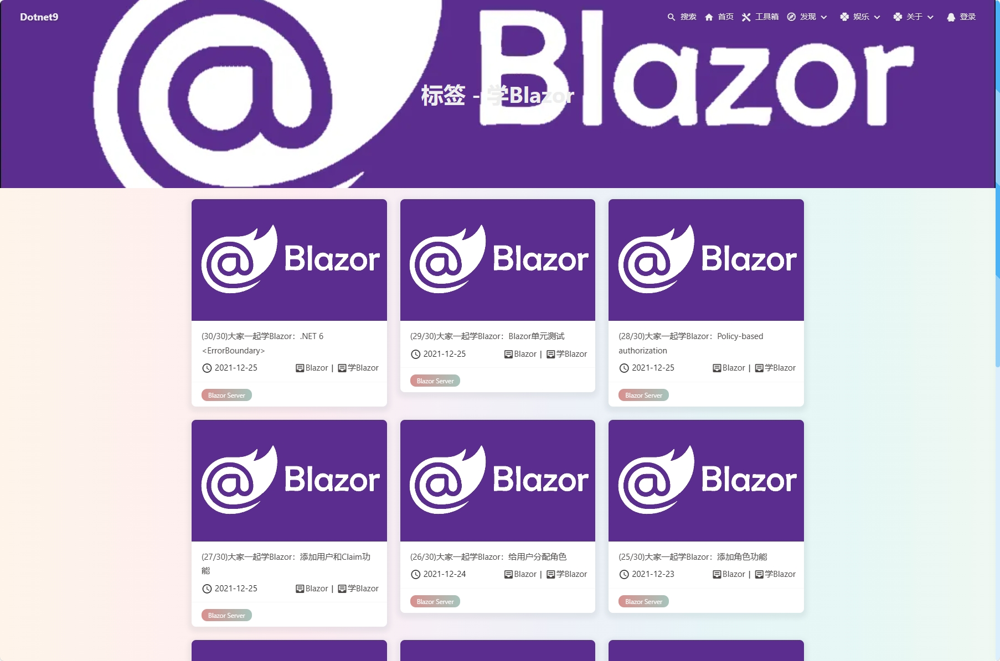

文章标签

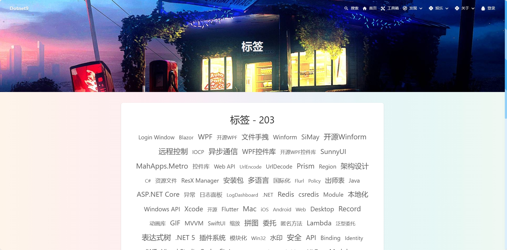

文章详情


文章留言

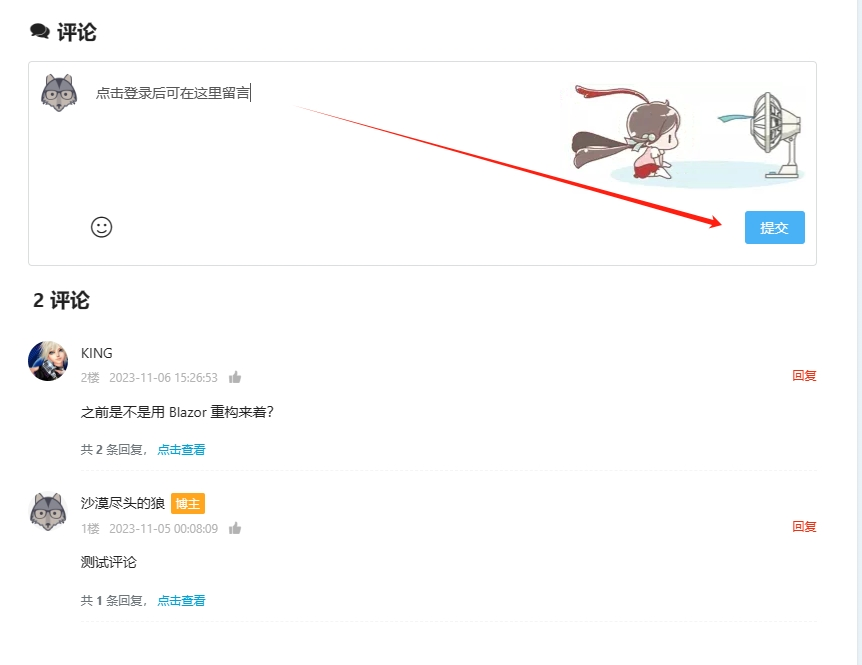

### 2.2. 后台前端

后台登录

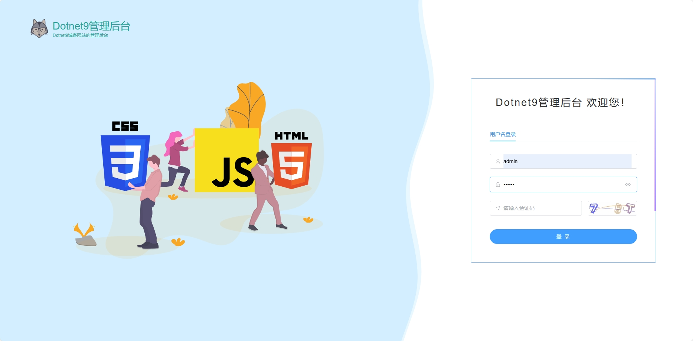

分类管理

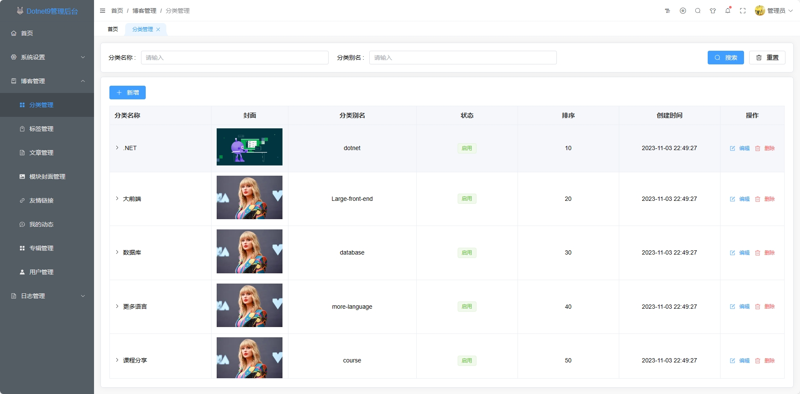

专辑管理

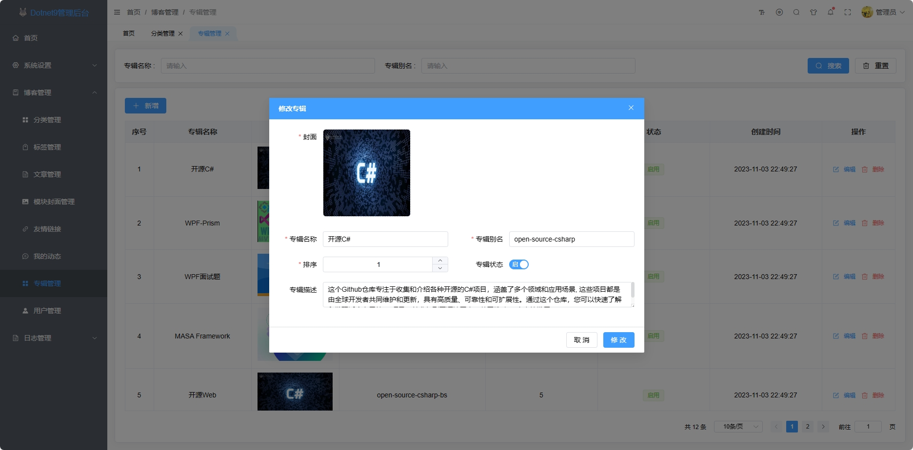

文章管理

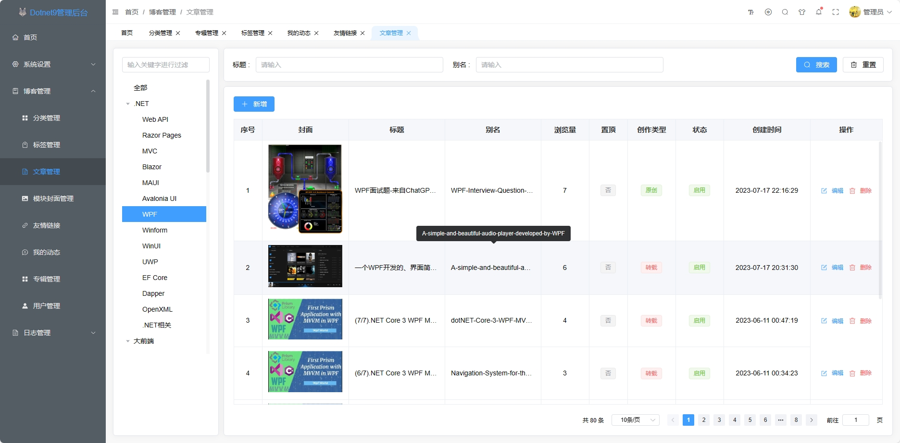

文章编辑

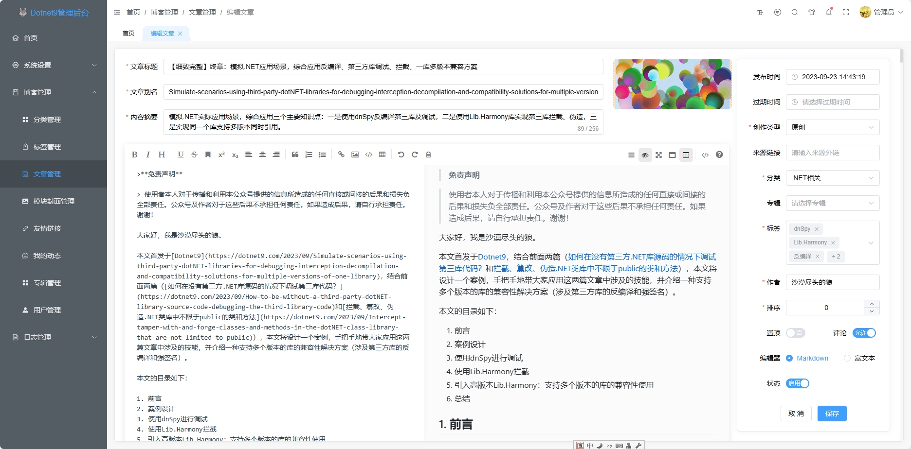

## 🖥 3. 支持环境

- .NET 8.0
- Vue 3.2
- Visual Studio 2022
- Visual Code
- PostgreSQL

### 3.1 项目配置

正确运行前，请先对项目进行配置，请看下面说明。

1. 克隆Dotnet9文章等资源

将仓库(https://github.com/dotnet9/Assets.Dotnet9)克隆到本地，比如：F:\github_gitee\Assets.Dotnet9

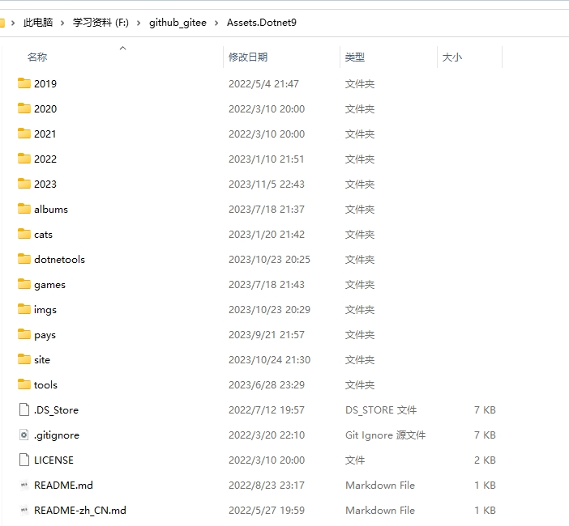

2. 修改配置

打开Dotnet9.Application/applicationsettings.json，主要修改以下节点

- Site：配置种子数据目录
- DbConnection：配置数据库连接信息
- OssConnection：对象存储，比如文章封面等存储
- oauth：QQ等第三方登录

下面的配置有相关注释，其中重点配置需要修改

```json
{
  "$schema": "https://gitee.com/dotnetchina/Furion/raw/v4/schemas/v4/furion-schema.json",
  "SpecificationDocumentSettings": {
    "DocumentTitle": "Dotnet9 | 规范化接口",
    "GroupOpenApiInfos": [
      {
        "Group": "Default",
        "Title": "博客后端接口",
        "Description": "Dotnet9后端",
        "Version": "0.0.1",
        "TermsOfService": "https://furion.baiqian.ltd",
        "Contact": {
          "Name": "沙漠尽头的狼",
          "Url": "https://github.com/dotnet9",
          "Email": "632871194@qq.com"
        },
        "License": {
          "Name": "MIT",
          "Url": ""
        }
      }
    ]
  },
  "Site": {
    "Domain": "https://dotnet9.com",
    "AssetsDir": "F:\\github_gitee\\Assets.Dotnet9",
    "AssetsUrl": "https://img1.dotnet9.com",
    "Owner": "沙漠尽头的狼",
    "Start": 2019
  },
  "DynamicApiControllerSettings": {
    "CamelCaseSeparator": ""
  },
  "CorsAccessorSettings": {
    "WithExposedHeaders": [
      "access-token",
      "x-access-token",
      "environment"
    ]
  },
  //ORM数据库连接配置 文档：https://www.donet5.com/Home/Doc?typeId=1181
  "DbConnection": {
    "Connections": [
      {
        "ConfigId": 1,
        "DbType": "PostgreSQL", // MySql、SqlServer、Sqlite、Oracle、PostgreSQL、Dm、Kdbndp、Oscar、MySqlConnector、Access、OpenGauss、QuestDB、HG、ClickHouse、GBase、Odbc、Custom
        "ConnectionString": "Host=localhost;Username=postgres;Database=Dotnet9;port=5432;password=f5cYsx566fZF6hEs;", // PostgreSQL
        "IsAutoCloseConnection": true,
        "EnableInitDb": true // 启用数据库以及数据表初始化（首次运行项目时开启可以自动创建数据库和初始化项目运行的基础数据）
      }
    ]
  },
  //缓存配置 文档：https://easycaching.readthedocs.io/en/latest/
  "easycaching": {
    "csredis": {
      "MaxRdSecond": 120,
      "EnableLogging": false,
      "LockMs": 5000,
      "SleepMs": 300,
      "dbconfig": {
        "ConnectionStrings": [
          "127.0.0.1:6379,password=123456,defaultDatabase=0,poolsize=7"
        ],
        //"Sentinels": [
        //  "192.169.1.10:26379",
        //  "192.169.1.11:26379",
        //  "192.169.1.12:26379"
        //],
        "ReadOnly": false
      }
    },
    "inmemory": {
      "MaxRdSecond": 120,
      "EnableLogging": false,
      "LockMs": 5000,
      "SleepMs": 300,
      "DBConfig": {
        "SizeLimit": 10000,
        "ExpirationScanFrequency": 60,
        "EnableReadDeepClone": true,
        "EnableWriteDeepClone": false
      }
    }
  },
  //对象存储配置 文档：https://github.com/oncemi/OnceMi.AspNetCore.OSS
  "OssConnection": {
    "Enable": false, //是否启用对象存储（不启用将存储至站点目录）
    "Provider": "QCloud", //OSS提供者；允许值：Minio/Aliyun/QCloud/Qiniu/HuaweiCloud/（Invalid：代表附件存储到当前站点下）
    "Endpoint": "1258414763", //节点
    "AccessKey": "AKIDPd8NL9UeW7TYL527qHTO3fkOxEExPaU7", //Key
    "SecretKey": "NTIp5j8GSN1OVKs94uy6Q54mDOJxKQGp", //秘钥
    "Region": "ap-beijing", //地域，如果是QCloud必须要加上，OSS包上传会使用
    "IsEnableHttps": true, //是否启用HTTPS
    "IsEnableCache": true, //是否启用缓存(启用后将缓存签名URL，以减少请求次数)
    "Bucket": "img2-dotnet9", //默认存储根目录，也就是桶名，如果是QCloud，去掉桶名后台的APP ID后缀（即Endpoint值）
    "Domain": "https://img1.dotnet9.com" //外网访问域名或IP
  },
  // 接入第三方授权登录 文档：https://github.com/mrhuo/MrHuo.OAuth
  "oauth": {
    "qq": {
      "app_id": "101434831288",
      "app_key": "4cc9398bc588b45345454145a63a49a3fc90cb4",
      "redirect_uri": "https://dotnet9.com/api/oauth/qq/callback",
      "scope": "get_user_info"
    },
    "gitee": {
      "app_id": "a4eff6b04a7f0965a0c171c5460fe9af3c1455645645651c9d44b3f6fe2960cda0e0d17b9ad",
      "app_key": "7c8afb39d3279c4d6f654684a15c384a901b29fe0bdf788dc785675671aa899ca1e32f8916a1d",
      "redirect_uri": "https://dotnet9.com/api/oauth/gitee/callback",
      "scope": "user_info"
    },
    "github": {
      "app_id": "2650d9528567860a42c047abf",
      "app_key": "045ef356767addf83ffa49b4a8567d7e428f7956d4cf560dc",
      "redirect_uri": "https://dotnet9.com/api/oauth/github/callback",
      "scope": "repo"
    },
    "redirect_uri": "https://dotnet9.com" //授权成功后跳转地址
  },
  // 雪花id 文档：https://github.com/yitter/IdGenerator
  "SnowId": {
    "Method": 1, //雪花计算方法（1-漂移算法|2-传统算法），默认1 
    "BaseTime": "2023-01-01 08:00:00", //不能超过当前系统时间  
    "WorkerId": 0, //机器码, 最大值 2^WorkerIdBitLength-1
    "WorkerIdBitLength": 6, // 机器码位长 , 默认值6，取值范围 [1, 15]（要求：序列数位长+机器码位长不超过22）
    "SeqBitLength": 6, //序列数位长,默认值6，取值范围 [3, 21]（要求：序列数位长+机器码位长不超过22） 
    "MaxSeqNumber": 0, //最大序列数（含）,设置范围 [MinSeqNumber, 2^SeqBitLength-1]，默认值0，表示最大序列数取最大值（2^SeqBitLength-1]）
    "MinSeqNumber": 5, //最小序列数（含）,默认值5，取值范围 [5, MaxSeqNumber]，每毫秒的前5个序列数对应编号0-4是保留位，其中1-4是时间回拨相应预留位，0是手工新值预留位
    "TopOverCostCount": 2000, //最大漂移次数（含），默认2000，推荐范围500-10000（与计算能力有关）
    "DataCenterId": 0, //数据中心ID（默认0）,每台服务器需要设置不同值
    "DataCenterIdBitLength": 0, //数据中心ID（默认0）
    "TimestampType": 0 //时间戳类型（0-毫秒，1-秒），默认0
  },
  // 日志配置
  "Logging": {
    "Monitor": {
      "GlobalEnabled": true, // 是否启用全局拦截，默认 `false`
      "IncludeOfMethods": [], // 是否指定拦截特定方法，当 GlobalEnabled: false 有效
      "ExcludeOfMethods": [], // 是否指定排除特定方法，当 GlobalEnabled: true 有效
      "BahLogLevel": "Information", // 配置 Oops.Oh 和 Oops.Bah 业务日志输出级别，默认 Information
      "WithReturnValue": true, // 配置是否包含返回值，默认 `true`，Furion 4.3.9+ 有效
      "ReturnValueThreshold": 0, // 配置返回值字符串阈值，默认 0，全量输出，Furion 4.3.9+ 有效
      "JsonBehavior": "None", // 配置 LoggingMonitor Json 输出行为，默认 None，Furion 4.5.2+ 有效
      "JsonIndented": false, // 配置 LoggingMonitor Json 格式化行为，默认 false，Furion 4.8.2+ 有效
      "ContractResolver": "CamelCase" // 配置 LoggingMonitor 序列化属性命名规则，默认 CamelCase，Furion 4.8.6.12+ 有效
      //"MethodsSettings": [
      //  // 配置被监视方法更多信息，Furion 4.3.9+ 有效
      //  {
      //    "FullName": "Furion.Application.TestLoggerServices.MethodName", // 方法完全限定名
      //    "WithReturnValue": true, // 配置是否包含返回值，默认 `true`，Furion 4.3.9+ 有效
      //    "ReturnValueThreshold": 0, // 配置返回值字符串阈值，默认 0，全量输出，Furion 4.3.9+ 有效
      //    "JsonIndented": false, // 配置 LoggingMonitor Json 格式化行为，默认 false，Furion 4.8.2+ 有效
      //    "JsonBehavior": "None", // 配置 LoggingMonitor Json 输出行为，默认 None，Furion 4.5.2+ 有效
      //    "ContractResolver": "CamelCase" // 配置 LoggingMonitor 序列化属性命名规则，默认 CamelCase，Furion 4.8.6.12+ 有效
      //  }
      //]
    }
  }
}
```

3. 生成种子数据

以上配置好后，直接运行Dotnet9.Web.Entry项目即可生成种子数据

4. 博客前台前端

>运行后台管理端或者博客前请先检查本地的node版本；node版本 >= 16

打开程序目录【Dotnet9.VueBlogSpa】，安装node.js等依赖

```shell
npm install
npm run dev
npm run build
```

5. 博客后台前端

打开程序目录【Dotnet9.VueAdmin】，安装node.js等依赖

```shell
npm install
npm run dev
npm run build
```

## ☀️ License

MIT

## 建站文章分享

- 网站文章介绍：[分享我做Dotnet9博客网站时积累的一些资料](https://dotnet9.com/2022/03/Share-some-learning-materials-I-accumulated-when-I-was-a-blog-website)，[蚂蚁集团旗下语雀崩溃！如何避免类似情况？打造个性化博客网站，稳定无惧！](https://dotnet9.com/2023/10/ant-groups-language-sparrow-collapses-how-to-avoid-similar-situations-create-a-personalized-blog-website-stable-and-fearless)
- Dotnet工具箱介绍：[Dotnet工具箱：开源、免费的纯前端工具网站，带你探索10大工具分类和73个实时在线小工具](https://dotnet9.com/2023/10/dotnet-toolbox-open-source-free-pure-front-end-tool-website-that-takes-you-to-explore-10-major-tool-categories-and-73-real-time-online-small-tools)

## 感谢

- [Easy.Admin](https://gitee.com/miss_you/easy-admin)

Dotnet9网站前后台基于该开源项目编写，在线网址：https://www.okay123.top/

- [Furion](http://furion.baiqian.ltd/)

百大师作品，网站后台使用Furion搭建

- [SqlSugar](https://gitee.com/dotnetchina/SqlSugar)

后端采用的数据库ORM框架，文档地址：https://www.donet5.com/Home/Doc

- [Vue](https://cn.vuejs.org/)

网站前后台前端使用Vue搭建

- [element-plus](https://element-plus.gitee.io/zh-CN/)

Vue组件库

- [vue-next-admin](https://gitee.com/lyt-top/vue-next-admin)

后台前端框架

还有太多框架未一一列举，感谢开源给予的力量。

## 💕 支持本项目

|  |  |  |
| ------------------------- | ---------------------- | --------------------- |