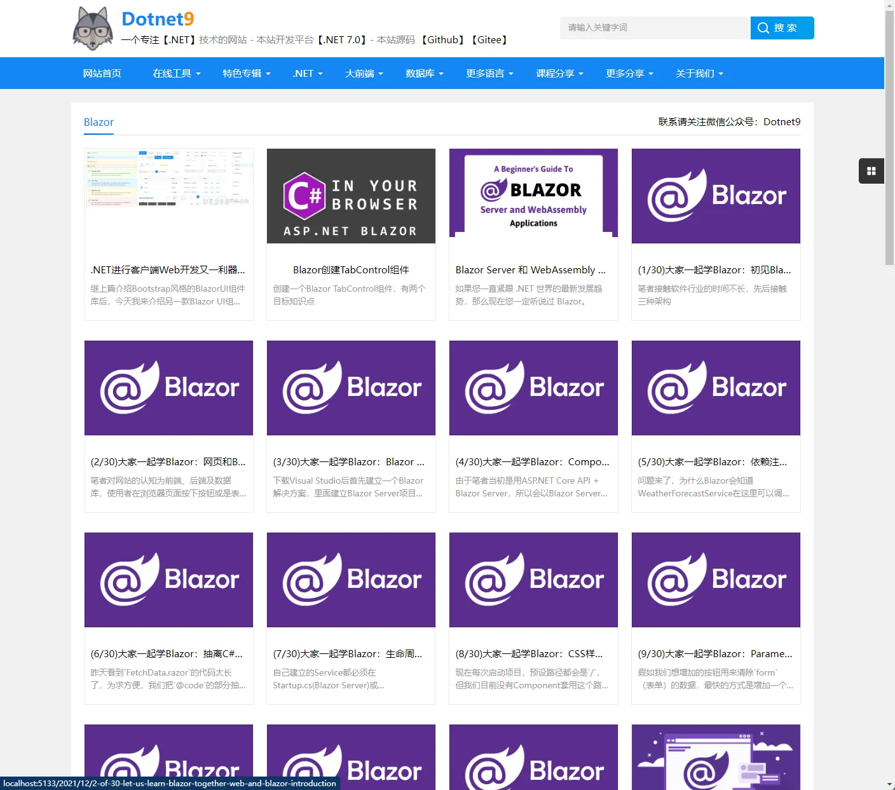
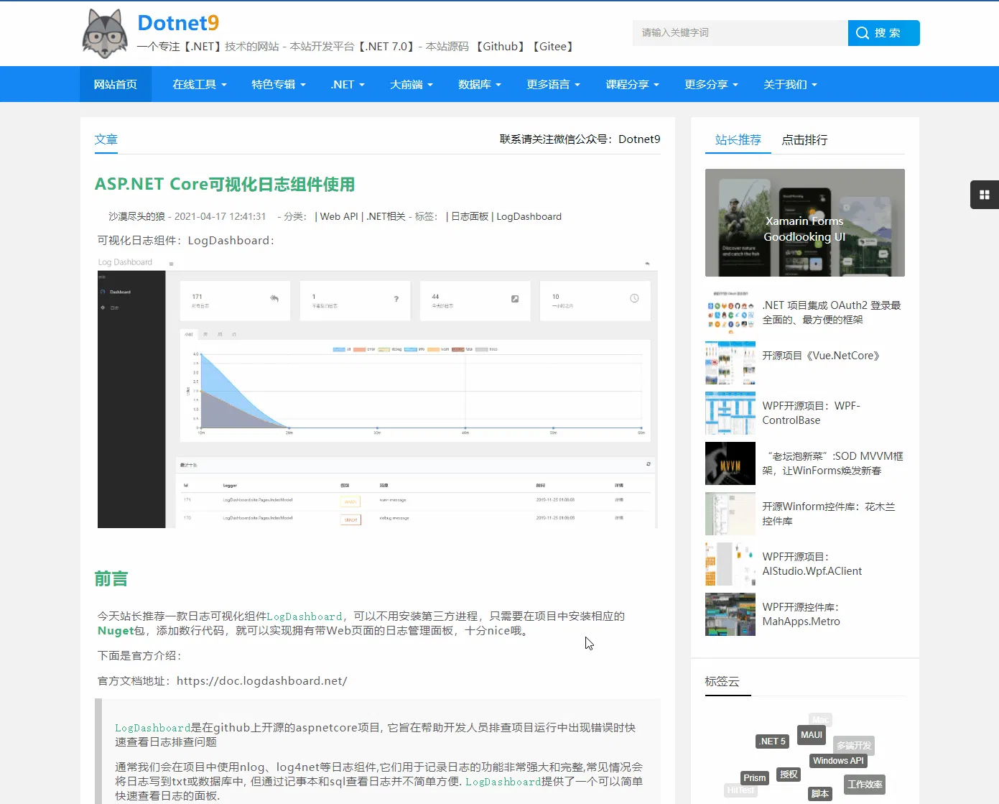

# Dotnet9 MVC版本

目前这一版不在维护，使用Razor Pages重构，换了一个主题风格，下面看看原MVC主题风格吧，购买的杨青青 [帝国cms模板《青于蓝门户》门户网站模板](http://menhu.ip3q.com/)：

首页：

专辑之一：[开源WPF](https://dotnet9.com/album/open-source-wpf)

分类之一：[Blazor](https://dotnet9.com/cat/dotnet-web-blazor)

文章之一：[ASP.NET Core可视化日志组件使用](https://dotnet9.com/2021/04/asp-dotnet-core-visual-log-component)

